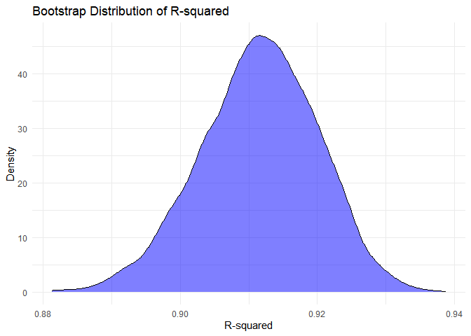
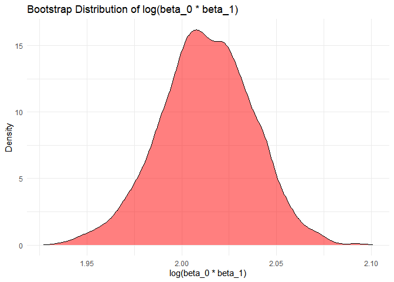
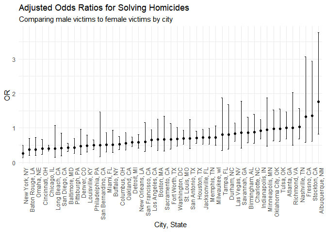
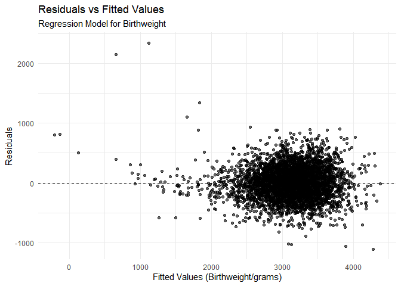
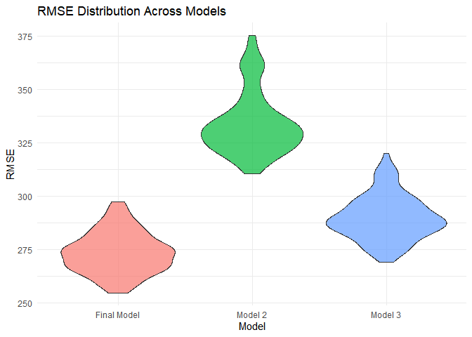

p8105_hw6_yj2802
================
Yizhen Jia
2024-12-02

``` r
library(p8105.datasets)
library(tidyverse)
```

    ## ── Attaching core tidyverse packages ──────────────────────── tidyverse 2.0.0 ──
    ## ✔ dplyr     1.1.4     ✔ readr     2.1.5
    ## ✔ forcats   1.0.0     ✔ stringr   1.5.1
    ## ✔ ggplot2   3.5.1     ✔ tibble    3.2.1
    ## ✔ lubridate 1.9.3     ✔ tidyr     1.3.1
    ## ✔ purrr     1.0.2     
    ## ── Conflicts ────────────────────────────────────────── tidyverse_conflicts() ──
    ## ✖ dplyr::filter() masks stats::filter()
    ## ✖ dplyr::lag()    masks stats::lag()
    ## ℹ Use the conflicted package (<http://conflicted.r-lib.org/>) to force all conflicts to become errors

``` r
library(modelr)
library(broom)
```

    ## 
    ## Attaching package: 'broom'
    ## 
    ## The following object is masked from 'package:modelr':
    ## 
    ##     bootstrap

``` r
library(purrr)
library(boot)
library(knitr)
```

## Problem 1

``` r
weather_df = 
  rnoaa::meteo_pull_monitors(
    c("USW00094728"),
    var = c("PRCP", "TMIN", "TMAX"), 
    date_min = "2017-01-01",
    date_max = "2017-12-31") %>%
  mutate(
    name = recode(id, USW00094728 = "CentralPark_NY"),
    tmin = tmin / 10,
    tmax = tmax / 10) %>%
  select(name, id, everything())
```

    ## using cached file: C:\Users\22865\AppData\Local/R/cache/R/rnoaa/noaa_ghcnd/USW00094728.dly

    ## date created (size, mb): 2024-12-02 18:03:47.161343 (8.685)

    ## file min/max dates: 1869-01-01 / 2024-11-30

This dataset has 365 observations and 6 variables (name, id, date, prcp,
tmax, tmin)

``` r
# Function for Bootstrap Analysis
bootstrap_analysis = function(data, indices) {
  bootstrap_sample = data[indices, ] # Generate bootstrap sample
  
  # Fit the linear regression model
  bootstrap_fit = lm(tmax ~ tmin, data = bootstrap_sample)
  
  # Extract R-squared
  r_squared = broom::glance(bootstrap_fit)$r.squared
  
  # Extract coefficients and compute log(beta_0 * beta_1)
  coefs = broom::tidy(bootstrap_fit) |>
    filter(term %in% c("(Intercept)", "tmin")) |>
    pull(estimate)
  log_beta_product = log(coefs[1] * coefs[2])
  
  return(c(r_squared = r_squared, log_beta_product = log_beta_product))
}

# Perform Bootstrap Resampling
set.seed(123)
bootstrap_results = boot(
  data = weather_df,
  statistic = function(data, indices) unlist(bootstrap_analysis(data, indices)),
  R = 5000
)

# Create a Data Frame of Bootstrap Results
bootstrap_df = as_tibble(bootstrap_results$t) |>
  rename(r_squared = V1, log_beta_product = V2)
```

    ## Warning: The `x` argument of `as_tibble.matrix()` must have unique column names if
    ## `.name_repair` is omitted as of tibble 2.0.0.
    ## ℹ Using compatibility `.name_repair`.
    ## This warning is displayed once every 8 hours.
    ## Call `lifecycle::last_lifecycle_warnings()` to see where this warning was
    ## generated.

``` r
# Plot Distribution of R-squared
r_squared_plot = bootstrap_df |>
  ggplot(aes(x = r_squared)) +
  geom_density(fill = "blue", alpha = 0.5) +
  labs(
    title = "Bootstrap Distribution of R-squared",
    x = "R-squared",
    y = "Density"
  ) +
  theme_minimal()

print(r_squared_plot)
```

<!-- -->

``` r
# Plot Distribution of log(beta_0 * beta_1)
log_beta_plot = bootstrap_df |>
  ggplot(aes(x = log_beta_product)) +
  geom_density(fill = "red", alpha = 0.5) +
  labs(
    title = "Bootstrap Distribution of log(beta_0 * beta_1)",
    x = "log(beta_0 * beta_1)",
    y = "Density"
  ) +
  theme_minimal()

print(log_beta_plot)
```

<!-- -->

``` r
# Compute 95% Confidence Intervals
ci_r_squared = quantile(bootstrap_df$r_squared, probs = c(0.025, 0.975))
ci_log_beta_product = quantile(bootstrap_df$log_beta_product, probs = c(0.025, 0.975))

ci_df = tibble(
  Metric = c("R-squared", "log(beta_0 * beta_1)"),
  `Lower 2.5%` = c(ci_r_squared[1], ci_log_beta_product[1]),
  `Upper 97.5%` = c(ci_r_squared[2], ci_log_beta_product[2])
)

knitr::kable(ci_df, caption = "95% Confidence Intervals for Bootstrap Estimates")
```

| Metric                | Lower 2.5% | Upper 97.5% |
|:----------------------|-----------:|------------:|
| R-squared             |  0.8937925 |    0.927196 |
| log(beta_0 \* beta_1) |  1.9631287 |    2.058541 |

95% Confidence Intervals for Bootstrap Estimates

``` r
# Final Outputs
ci_r_squared
```

    ##      2.5%     97.5% 
    ## 0.8937925 0.9271960

``` r
ci_log_beta_product
```

    ##     2.5%    97.5% 
    ## 1.963129 2.058541

## Problem 2

``` r
url = "https://raw.githubusercontent.com/washingtonpost/data-homicides/master/homicide-data.csv"
homicides = read_csv(url, show_col_types = FALSE)

problem2 = 
  homicides |> 
  mutate(
    across(where(is.character), ~ na_if(., "Unknown")), 
    city_state = str_c(city, state, sep = ", "),
    victim_age = as.numeric(victim_age),
    resolution = case_when(
      disposition %in% c("Closed without arrest", "Open/No arrest") ~ 0,
      disposition == "Closed by arrest" ~ 1,
      TRUE ~ NA_real_ 
    )
  ) |> 
  filter(
    !(city_state %in% c("Dallas, TX", "Phoenix, AZ", "Kansas City, MO", "Tulsa, AL")),
    victim_race %in% c("White", "Black"),
    !is.na(victim_age)
  ) |> 
  select(city_state, resolution, victim_age, victim_sex, victim_race)
```

#### logistic regression model (Baltimore, MD):

``` r
baltimore_glm = 
  problem2 |> 
  filter(city_state == "Baltimore, MD") |> 
  glm(resolution ~ victim_age + victim_sex + victim_race, family = binomial(), data = _)

baltimore_glm |> 
  broom::tidy() |> 
  mutate(
    OR = exp(estimate),
    OR_CI_lower = exp(estimate - 1.96 * std.error),
    OR_CI_upper = exp(estimate + 1.96 * std.error)
  ) |> 
  filter(term == "victim_sexMale") |> 
  select(OR, OR_CI_lower, OR_CI_upper) |>
  knitr::kable(digits = 4)
```

|     OR | OR_CI_lower | OR_CI_upper |
|-------:|------------:|------------:|
| 0.4255 |      0.3246 |      0.5579 |

#### logistic regression models for each of the cities:

``` r
model = 
  problem2 |> 
  nest(data = -city_state) |> 
  mutate(
    models = map(data, ~ glm(resolution ~ victim_age + victim_sex + victim_race, 
                              family = binomial(), data = .x)),
    tidy_models = map(models, broom::tidy)
  ) |> 
  select(city_state, tidy_models) |> 
  unnest(cols = tidy_models) |> 
  mutate(
    OR = exp(estimate),
    OR_CI_lower = exp(estimate - 1.96 * std.error),
    OR_CI_upper = exp(estimate + 1.96 * std.error)
  ) |> 
  filter(term == "victim_sexMale") |> 
  select(city_state, OR, OR_CI_lower, OR_CI_upper)

model |> 
  slice(1:5) |> 
  knitr::kable(digits = 4)
```

| city_state      |     OR | OR_CI_lower | OR_CI_upper |
|:----------------|-------:|------------:|------------:|
| Albuquerque, NM | 1.7675 |      0.8307 |      3.7609 |
| Atlanta, GA     | 1.0001 |      0.6836 |      1.4631 |
| Baltimore, MD   | 0.4255 |      0.3246 |      0.5579 |
| Baton Rouge, LA | 0.3814 |      0.2093 |      0.6953 |
| Birmingham, AL  | 0.8700 |      0.5743 |      1.3180 |

#### Plot:

``` r
model |> 
  mutate(city_state = fct_reorder(city_state, OR)) |>
  ggplot(aes(x = city_state, y = OR)) + 
  geom_point() + 
  geom_errorbar(aes(ymin = OR_CI_lower, ymax = OR_CI_upper), width = 0.2) + 
  labs(
    x = "City, State",
    y = "OR",
    title = "Adjusted Odds Ratios for Solving Homicides",
    subtitle = "Comparing male victims to female victims by city"
  ) + 
  theme_minimal() + 
  theme(axis.text.x = element_text(angle = 90, hjust = 1))
```

<!-- -->

This plot shows the adjusted ORs and 95% CIs across cities.

Albuquerque has the highest OR, suggesting potential higher odds of
solving male victim cases compared to female victim cases (95% CI
includes 1, not significant). Cities such as New York, Baton Rouge and
Omaha have ORs and 95% CIs below 1, suggesting male victims are
significantly less likely to have cases resolved compared to female
victims. Cities with ORs close to 1, such as Tulsa, Atlanta, and
Richmond, suggest minimal differences between genders.

## Problem 3

``` r
birthweight = 
  read_csv("birthweight.csv", na = c("", "NA", "Unknown"), show_col_types = FALSE) |> 
  mutate(
    babysex = factor(babysex, levels = c(1, 2), labels = c("Male", "Female")),
    frace = factor(frace, levels = c(1, 2, 3, 4, 8), 
                   labels = c("White", "Black", "Asian", "Puerto Rican", "Other")),
    mrace = factor(mrace, levels = c(1, 2, 3, 4, 8), 
                   labels = c("White", "Black", "Asian", "Puerto Rican", "Other")),
    malform = factor(malform, levels = c(0, 1), labels = c("Absent", "Present")),
    parity = as.numeric(parity),
    smoken = replace_na(smoken, 0),
    wtgain = as.numeric(wtgain)
  ) |> 
  drop_na()
```

#### Model building

``` r
# Full regression model for birthweight:
model_full = 
  lm(
    bwt ~ babysex + bhead + blength + delwt + fincome + frace + gaweeks + malform + menarche + mheight + momage + mrace + parity + pnumlbw + pnumsga + ppbmi + ppwt + smoken + wtgain,
    data = birthweight
  )

# Remove those are not significant at 0.05 significance level (one by one) to get the final model:
model_final = 
  lm(
    bwt ~ babysex + bhead + blength + delwt + gaweeks + mheight + mrace + parity + ppwt + smoken,
    data = birthweight
  )
summary(model_final)
```

    ## 
    ## Call:
    ## lm(formula = bwt ~ babysex + bhead + blength + delwt + gaweeks + 
    ##     mheight + mrace + parity + ppwt + smoken, data = birthweight)
    ## 
    ## Residuals:
    ##      Min       1Q   Median       3Q      Max 
    ## -1106.16  -183.65    -2.51   174.67  2338.68 
    ## 
    ## Coefficients:
    ##                     Estimate Std. Error t value Pr(>|t|)    
    ## (Intercept)       -6101.8188   137.5732 -44.353  < 2e-16 ***
    ## babysexFemale        28.3735     8.4565   3.355 0.000800 ***
    ## bhead               131.0228     3.4448  38.035  < 2e-16 ***
    ## blength              74.7933     2.0178  37.066  < 2e-16 ***
    ## delwt                 4.0840     0.3920  10.419  < 2e-16 ***
    ## gaweeks              11.6785     1.4617   7.990 1.72e-15 ***
    ## mheight               6.8569     1.7795   3.853 0.000118 ***
    ## mraceBlack         -145.3753     9.2256 -15.758  < 2e-16 ***
    ## mraceAsian          -77.9781    42.2918  -1.844 0.065279 .  
    ## mracePuerto Rican  -105.9871    19.1083  -5.547 3.09e-08 ***
    ## parity               94.8103    40.3386   2.350 0.018800 *  
    ## ppwt                 -2.6507     0.4273  -6.204 6.02e-10 ***
    ## smoken               -4.8738     0.5855  -8.324  < 2e-16 ***
    ## ---
    ## Signif. codes:  0 '***' 0.001 '**' 0.01 '*' 0.05 '.' 0.1 ' ' 1
    ## 
    ## Residual standard error: 272.4 on 4329 degrees of freedom
    ## Multiple R-squared:  0.7179, Adjusted R-squared:  0.7171 
    ## F-statistic:   918 on 12 and 4329 DF,  p-value: < 2.2e-16

The modeling process began by exploring the relationships between
birthweight and other variables through summary statistics to identify
potential predictors. Firstly, a full regression model was constructed
including all available variables hypothesized to influence birthweight.
Using a data-driven approach, I iteratively removed variables with the
highest p-values (greater than 0.05) one at a time to refine the model.
The final model retained only significant predictors, ensuring that all
variables had p-values below 0.05 (except one dummy variable). This
resulted in a parsimonious model with a Residual Standard Error of
272.4, an Adjusted R-squared of 0.7171, and a highly significant
F-statistic (p \< 0.0001), indicating strong explanatory power and a
good fit for the data.

#### Plot (Residuals vs Fitted Values):

``` r
birthweight = 
  birthweight |> 
  add_predictions(model_final) |> 
  add_residuals(model_final)

birthweight |> 
  ggplot(aes(x = pred, y = resid)) +
  geom_point(alpha = 0.6) +
  geom_hline(yintercept = 0, linetype = "dashed") +
  labs(
    x = "Fitted Values (Birthweight/grams)",
    y = "Residuals",
    title = "Residuals vs Fitted Values",
    subtitle = "Regression Model for Birthweight"
  ) +
  theme_minimal()
```

<!-- -->

#### Comparing models:

``` r
crossv = 
  crossv_mc(birthweight, 100) |>
  mutate(
    train = map(train, as_tibble),
    test = map(test, as_tibble)
  ) |> 
  mutate(
    final_model = map(train, ~ lm(bwt ~ babysex + bhead + blength + delwt + fincome + gaweeks + mheight + mrace + parity + ppwt + smoken, data = .x)),
    model2 = map(train, ~ lm(bwt ~ blength + gaweeks, data = .x)),
    model3 = map(train, ~ lm(bwt ~ bhead * blength * babysex, data = .x))
  ) |> 
  mutate(
    rmse_final = map2_dbl(final_model, test, ~rmse(model = .x, data = .y)),
    rmse_model2 = map2_dbl(model2, test, ~rmse(model = .x, data = .y)),
    rmse_model3 = map2_dbl(model3, test, ~rmse(model = .x, data = .y))
  )
```

    ## Warning: There were 3 warnings in `mutate()`.
    ## The first warning was:
    ## ℹ In argument: `rmse_final = map2_dbl(final_model, test, ~rmse(model = .x, data
    ##   = .y))`.
    ## Caused by warning in `predict.lm()`:
    ## ! prediction from rank-deficient fit; attr(*, "non-estim") has doubtful cases
    ## ℹ Run `dplyr::last_dplyr_warnings()` to see the 2 remaining warnings.

``` r
crossv_plot = crossv |> 
  select(starts_with("rmse")) |> 
  pivot_longer(
    everything(),
    names_to = "model",
    values_to = "rmse",
    names_prefix = "rmse_"
  ) |> 
  mutate(model = recode(model,
                        final = "Final Model",
                        model2 = "Model 2",
                        model3 = "Model 3")) |> 
  ggplot(aes(x = model, y = rmse, fill = model)) + 
  geom_violin(alpha = 0.7) +
  labs(
    title = "RMSE Distribution Across Models",
    x = "Model",
    y = "RMSE"
  ) +
  theme_minimal() +
  theme(legend.position = "none")

print(crossv_plot)
```

<!-- -->

The plot shows the distribution of RMSE values for the three models
across 100 cross-validation splits. The Final Model exhibits the lowest
median RMSE and the least variability, indicating that it consistently
performs well. Comparing to model 2 and model 3, the Final Model strikes
the best balance between accuracy and stability.
