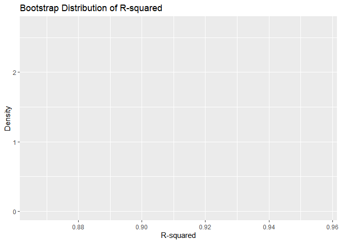

p8105_hw6_yj2802
================
Yizhen Jia
2024-12-02

``` r
library(p8105.datasets)
library(tidyverse)
```

    ## ── Attaching core tidyverse packages ──────────────────────── tidyverse 2.0.0 ──
    ## ✔ dplyr     1.1.4     ✔ readr     2.1.5
    ## ✔ forcats   1.0.0     ✔ stringr   1.5.1
    ## ✔ ggplot2   3.5.1     ✔ tibble    3.2.1
    ## ✔ lubridate 1.9.3     ✔ tidyr     1.3.1
    ## ✔ purrr     1.0.2     
    ## ── Conflicts ────────────────────────────────────────── tidyverse_conflicts() ──
    ## ✖ dplyr::filter() masks stats::filter()
    ## ✖ dplyr::lag()    masks stats::lag()
    ## ℹ Use the conflicted package (<http://conflicted.r-lib.org/>) to force all conflicts to become errors

``` r
library(modelr)
library(broom)
```

    ## 
    ## Attaching package: 'broom'
    ## 
    ## The following object is masked from 'package:modelr':
    ## 
    ##     bootstrap

``` r
library(purrr)
```

## Problem 1

## Problem 2

``` r
url = "https://raw.githubusercontent.com/washingtonpost/data-homicides/master/homicide-data.csv"
homicides = read_csv(url)
```

    ## Rows: 52179 Columns: 12
    ## ── Column specification ────────────────────────────────────────────────────────
    ## Delimiter: ","
    ## chr (9): uid, victim_last, victim_first, victim_race, victim_age, victim_sex...
    ## dbl (3): reported_date, lat, lon
    ## 
    ## ℹ Use `spec()` to retrieve the full column specification for this data.
    ## ℹ Specify the column types or set `show_col_types = FALSE` to quiet this message.

``` r
problem2 = 
  homicides |> 
  mutate(
    city_state = str_c(city, state, sep = ", "),
    victim_age = as.numeric(victim_age),
    resolution = case_when(
      disposition %in% c("Closed without arrest", "Open/No arrest") ~ 0,
      disposition == "Closed by arrest" ~ 1
    )
  ) |> 
  filter(
    !(city_state %in% c("Dallas, TX", "Phoenix, AZ", "Kansas City, MO", "Tulsa, AL")), # Remove specified cities
    victim_race %in% c("White", "Black"),
    !is.na(victim_age)
  ) |> 
  select(city_state, resolution, victim_age, victim_sex, victim_race)
```

    ## Warning: There was 1 warning in `mutate()`.
    ## ℹ In argument: `victim_age = as.numeric(victim_age)`.
    ## Caused by warning:
    ## ! NAs introduced by coercion

#### logistic regression model (Baltimore, MD):

``` r
baltimore_glm = 
  problem2 |> 
  filter(city_state == "Baltimore, MD") |> 
  glm(resolution ~ victim_age + victim_sex + victim_race, family = binomial(), data = _)

baltimore_glm |> 
  broom::tidy() |> 
  mutate(
    OR = exp(estimate),
    OR_CI_lower = exp(estimate - 1.96 * std.error),
    OR_CI_upper = exp(estimate + 1.96 * std.error)
  ) |> 
  filter(term == "victim_sexMale") |> 
  select(OR, OR_CI_lower, OR_CI_upper) |>
  knitr::kable(digits = 4)
```

|     OR | OR_CI_lower | OR_CI_upper |
|-------:|------------:|------------:|
| 0.4255 |      0.3246 |      0.5579 |

#### logistic regression models for each of the cities:

``` r
model = 
  problem2 |> 
  nest(data = -city_state) |> 
  mutate(
    models = map(data, ~ glm(resolution ~ victim_age + victim_sex + victim_race, 
                              family = binomial(), data = .x)),
    tidy_models = map(models, broom::tidy)
  ) |> 
  select(city_state, tidy_models) |> 
  unnest(cols = tidy_models) |> 
  mutate(
    OR = exp(estimate),
    OR_CI_lower = exp(estimate - 1.96 * std.error),
    OR_CI_upper = exp(estimate + 1.96 * std.error)
  ) |> 
  filter(term == "victim_sexMale") |> 
  select(city_state, OR, OR_CI_lower, OR_CI_upper)

model |> 
  slice(1:5) |> 
  knitr::kable(digits = 4)
```

| city_state      |     OR | OR_CI_lower | OR_CI_upper |
|:----------------|-------:|------------:|------------:|
| Albuquerque, NM | 1.7675 |      0.8307 |      3.7609 |
| Atlanta, GA     | 1.0001 |      0.6836 |      1.4631 |
| Baltimore, MD   | 0.4255 |      0.3246 |      0.5579 |
| Baton Rouge, LA | 0.3814 |      0.2093 |      0.6953 |
| Birmingham, AL  | 0.8700 |      0.5743 |      1.3180 |

#### Plot:

``` r
model |> 
  mutate(city_state = fct_reorder(city_state, OR)) |>
  ggplot(aes(x = city_state, y = OR)) + 
  geom_point() + 
  geom_errorbar(aes(ymin = OR_CI_lower, ymax = OR_CI_upper), width = 0.2) + 
  labs(
    x = "City, State",
    y = "Odds Ratio (OR)",
    title = "Adjusted Odds Ratios for Solving Homicides",
    subtitle = "Comparing male victims to female victims by city"
  ) + 
  theme_minimal() + 
  theme(axis.text.x = element_text(angle = 90, hjust = 1))
```

<!-- -->

This plot shows the adjusted ORs and 95% CIs across cities.

Albuquerque has the highest OR, suggesting potential higher odds of
solving male victim cases compared to female victim cases (95% CI
includes 1, not significant). Cities such as New York, Baton Rouge and
Omaha have ORs and 95% CIs below 1, suggesting male victims are
significantly less likely to have cases resolved compared to female
victims. Cities with ORs close to 1, such as Tulsa, Atlanta, and
Richmond, suggest minimal differences between genders.

## Problem 3

``` r
birthweight = 
  read_csv("birthweight.csv", na = c("", "NA", "Unknown")) |> 
  mutate(
    babysex = factor(babysex, levels = c(1, 2), labels = c("Male", "Female")),
    frace = factor(frace, levels = c(1, 2, 3, 4, 8), labels = c("White", "Black", "Asian", "Puerto Rican", "Other")),
    mrace = factor(mrace, levels = c(1, 2, 3, 4, 8), labels = c("White", "Black", "Asian", "Puerto Rican", "Other")),
    malform = factor(malform, levels = c(0, 1), labels = c("Absent", "Present")),
    parity = as.numeric(parity),
    smoken = replace_na(smoken, 0),
    wtgain = as.numeric(wtgain)
  ) |> 
  drop_na()
```

    ## Rows: 4342 Columns: 20
    ## ── Column specification ────────────────────────────────────────────────────────
    ## Delimiter: ","
    ## dbl (20): babysex, bhead, blength, bwt, delwt, fincome, frace, gaweeks, malf...
    ## 
    ## ℹ Use `spec()` to retrieve the full column specification for this data.
    ## ℹ Specify the column types or set `show_col_types = FALSE` to quiet this message.

#### Model building

``` r
# Full regression model for birthweight:
model_full = 
  lm(
    bwt ~ babysex + bhead + blength + delwt + fincome + frace + gaweeks + malform + menarche + mheight + momage + mrace + parity + pnumlbw + pnumsga + ppbmi + ppwt + smoken + wtgain,
    data = birthweight
  )

# Remove those are not significant at 0.05 significance level (one by one) to get the final model:
model_final = 
  lm(
    bwt ~ babysex + bhead + blength + delwt + fincome + gaweeks + mheight + mrace + parity + ppwt + smoken,
    data = birthweight
  )
summary(model_final)
```

    ## 
    ## Call:
    ## lm(formula = bwt ~ babysex + bhead + blength + delwt + fincome + 
    ##     gaweeks + mheight + mrace + parity + ppwt + smoken, data = birthweight)
    ## 
    ## Residuals:
    ##      Min       1Q   Median       3Q      Max 
    ## -1097.18  -185.52    -3.39   174.14  2353.44 
    ## 
    ## Coefficients:
    ##                     Estimate Std. Error t value Pr(>|t|)    
    ## (Intercept)       -6098.8219   137.5463 -44.340  < 2e-16 ***
    ## babysexFemale        28.5580     8.4549   3.378 0.000737 ***
    ## bhead               130.7770     3.4466  37.944  < 2e-16 ***
    ## blength              74.9471     2.0190  37.120  < 2e-16 ***
    ## delwt                 4.1067     0.3921  10.475  < 2e-16 ***
    ## fincome               0.3180     0.1747   1.820 0.068844 .  
    ## gaweeks              11.5925     1.4621   7.929 2.79e-15 ***
    ## mheight               6.5940     1.7849   3.694 0.000223 ***
    ## mraceBlack         -138.7925     9.9071 -14.009  < 2e-16 ***
    ## mraceAsian          -74.8868    42.3146  -1.770 0.076837 .  
    ## mracePuerto Rican  -100.6781    19.3247  -5.210 1.98e-07 ***
    ## parity               96.3047    40.3362   2.388 0.017004 *  
    ## ppwt                 -2.6756     0.4274  -6.261 4.20e-10 ***
    ## smoken               -4.8434     0.5856  -8.271  < 2e-16 ***
    ## ---
    ## Signif. codes:  0 '***' 0.001 '**' 0.01 '*' 0.05 '.' 0.1 ' ' 1
    ## 
    ## Residual standard error: 272.3 on 4328 degrees of freedom
    ## Multiple R-squared:  0.7181, Adjusted R-squared:  0.7173 
    ## F-statistic: 848.1 on 13 and 4328 DF,  p-value: < 2.2e-16

The modeling process began by exploring the relationships between
birthweight and other variables through summary statistics to identify
potential predictors. Firstly, a full regression model was constructed
including all available variables hypothesized to influence birthweight.
Using a data-driven approach, I iteratively removed variables with the
highest p-values (greater than 0.05) one at a time to refine the model.
The final model retained only significant predictors, ensuring that all
variables had p-values below 0.05. This resulted in a parsimonious model
with a Residual Standard Error of 272.3, an Adjusted R-squared of
0.7173, and a highly significant F-statistic (p \< 0.0001), indicating
strong explanatory power and a good fit for the data.

#### Plot (Residuals vs Fitted Values):

``` r
birthweight = 
  birthweight |> 
  add_predictions(model_final) |> 
  add_residuals(model_final)

birthweight |> 
  ggplot(aes(x = pred, y = resid)) +
  geom_point(alpha = 0.6) +
  geom_hline(yintercept = 0, linetype = "dashed") +
  labs(
    x = "Fitted Values (Birthweight/grams)",
    y = "Residuals",
    title = "Residuals vs Fitted Values",
    subtitle = "Regression Model for Birthweight"
  ) +
  theme_minimal()
```

<!-- -->

#### Comparing models:

``` r
# Define model formulas
formula_final = bwt ~ babysex + bhead + blength + delwt + fincome + gaweeks + mheight + mrace + parity + ppwt + smoken
formula_model2 = bwt ~ blength + gaweeks
formula_model3 = bwt ~ bhead * blength * babysex

# Function to calculate mean squared error (MSE)
calculate_mse = function(formula, train, test) {
  train_data = as_tibble(train$data)
  test_data = as_tibble(test$data)
  fitted_model = lm(formula, data = train_data)
  predictions = predict(fitted_model, newdata = test_data)
  mse = mean((test_data$bwt - predictions)^2, na.rm = TRUE)
  return(mse)
}

# Cross-validation setup
set.seed(123)
cv_splits = crossv_mc(birthweight, n = 10)

# Calculate MSE for each model
mse_results = cv_splits |> 
  mutate(
    mse_final = map2_dbl(train, test, ~ calculate_mse(formula_final, .x, .y)),
    mse_model2 = map2_dbl(train, test, ~ calculate_mse(formula_model2, .x, .y)),
    mse_model3 = map2_dbl(train, test, ~ calculate_mse(formula_model3, .x, .y))
  )

# Summarize average MSE for each model
mse_summary = mse_results |> 
  summarize(
    final_model_mse = mean(mse_final),
    model2_mse = mean(mse_model2),
    model3_mse = mean(mse_model3)
  )
mse_summary |>
  knitr::kable(digits = 1)
```

| final_model_mse | model2_mse | model3_mse |
|----------------:|-----------:|-----------:|
|         73925.9 |   110957.1 |    82638.6 |

My final model outperforms the other two models in terms of predictive
accuracy, as indicated by its lowest cross-validated MSE of 73,925.9.
The second model, which uses only birth length and gestational age as
predictors, has the highest MSE of 110,957.1, reflecting its simplicity
and limited explanatory power. The third model, which includes head
circumference, birth length, sex, and all interactions, performs better
than the second model with an MSE of 82,638.6, but its added complexity
does not surpass the performance of my final model. This demonstrates
that the final model strikes a good balance between complexity and
predictive accuracy.
